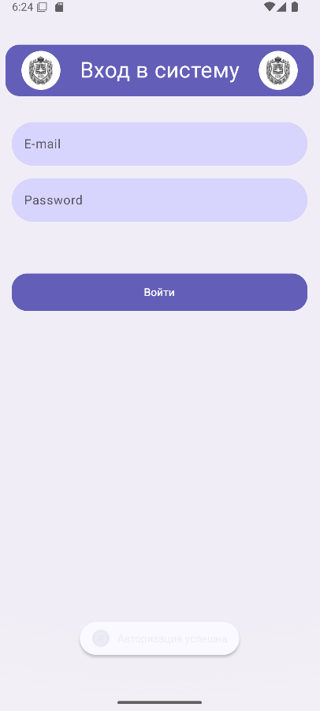
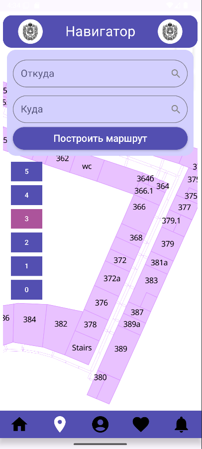
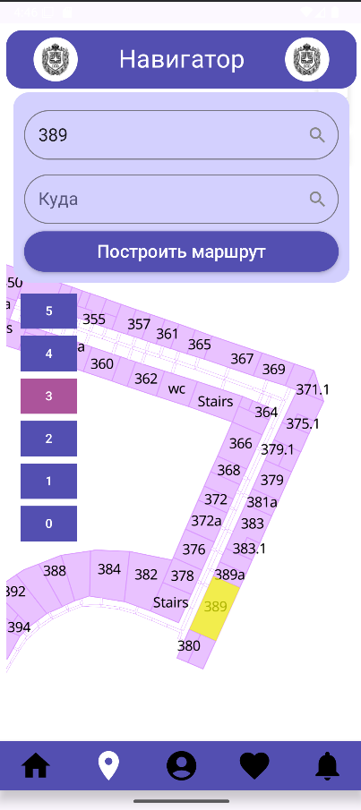
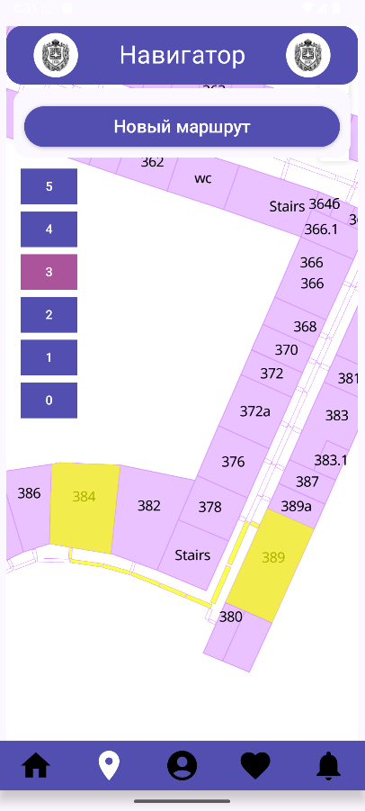
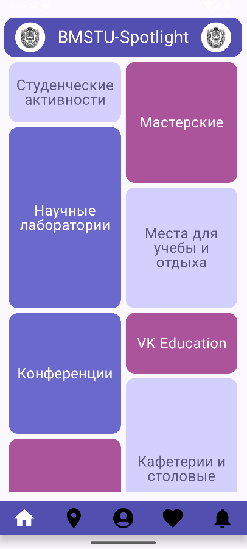
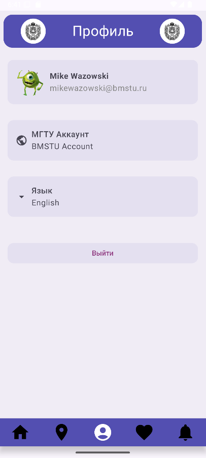
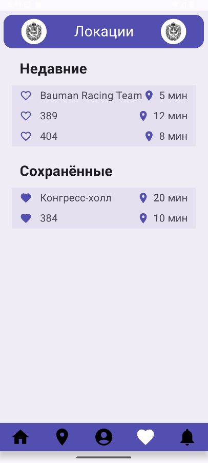
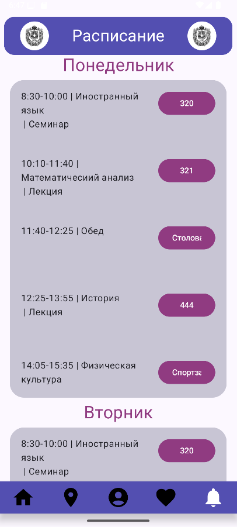

# BMSTU Spotlight
---
Приложение для навигации по кампусу МГТУ им. Н.Э. Баумана. 
Позволяет пользователю построить маршрут до точки назначения, получить краткую информацию о ключевых локациях университета, будь то коворкинг-зоны или кафетерии. 

# Временный раздел для преподавателей курса
---
Чтобы запустить приложение, 
1) Следует запустить сервер команды thread.sleepers в localhost: https://github.com/thread-sleepers/Spotlight-Backend.
Сервер запускается посредством консольной команды java -jar bmstu_spotlight_backend-all.jar в директории, в которой расположен сгенерируемый (посредством shadow) файл bmstu_spotlight_backend-all.jar
2) Для авторизации валидны следующие данные (они хранятся в базе данных пользователей):
       user1 123
ilya@mail.ru ilya
anya@mail.ru anya
vlad@mail.ru vlad
sasha@mail.ru sasha ,
где значения левого столбца - пользовательские e-mail'ы для авторизации, правого столбца - пользовательские пароли.
3) Для сборки приложения необходимо в local.properties добавить следующие апи-ключи (после строки sdk.dir):
API_KEY_4 = "pEC9gVZBA06hIDiYD3bk"
API_KEY_3 = "PHHZ2OozEcXHfqqJCqIr"
API_KEY_2 = "MyhK9LG5Sf1nMCLXhT8v"

Приятной работы с приложением! :)

# Команда авторов
---
- [Илья Нефёдов](https://github.com/ilyaniafiodau), менеджер-разработчик.
- [Анна Исаева](https://github.com/cr3at1v3annis), дизайнер-разработчик.
- [Александр Обехов](https://github.com/MrSashaNeo), разработчик.
- [Владислав Орешко](https://github.com/ByteTheKernel), разработчик.
# Функционал
---
## Вход в приложение
При запуске приложения высвечивается окно логина в систему.
Для аутентификации по введённым пользователем данным используется рукописный сервер на основе фреймворка Ktor: https://github.com/thread-sleepers/Spotlight-Backend.

## Навигатор по ВУЗу
Навигатор по ВУЗу (оно же главное окно) позволяет построить маршрут до требуемой локации. Для отображения карт реализуется взаимодействие с сервисом MapTiler. Сами карты были сделаны вручную при помощи геоинформационной системы QGIS. 

После выбора одной аудитории она подсвечивается другим цветом для удобства пользователям. 

После выбора маршрута простраивается маршрут. Сам маршрут и время рассчитываются при помощи алгоритма Дейкстры на основе взвешенного графа, хранимого в базе данных посредством Room.

## Экран "Меню" (с различными тематическими мастами и мероприятиями)
Экран, по которому можно посмотреть списки столовых и кафетериев, коворкинг-зон, проведение различных мероприятий на территории ВУЗа, аудиторий, магазинов. Также при нажатии на выбранную локацию произойдет перенаправление пользователя на главный экран, в котором искомая локация будет сразу подсвечена на карте.

## Экран профиля
На данном экране выведена информация о пользователе, полученная со стороны сервера, реализована возможность выйти из профиля.

## Экран недавних и сохраненных локаций
На данном экране можно посмотреть списки сохраненных пользователем локаций. При нажатии на локацию пользователя автоматически перенаправляют на экран навигатора с подсвечиванием данной локации.

## Экран расписания
На данном экране можно посмотреть расписание для пользователя. Оно синхронихировано с пользователем: данные отправляются сервером. При нажатии на локацию пользователя автоматически перенаправляют на экран навигатора с подсвечиванием данной локации.

# Стек технологий
- Базы данных - Room
- Работа с сетью - Retrofit
- Dependency injection - Koin
- Рукописный сервер на Ktor
- Отображение карт - сервер MapTiler
- Отрисовка карт - приложение QGis

# Планы на будущее
---
- Интеграция с действующим сервисом расписания для студентов МГТУ им. Н. Э. Баумана
- Расширение функционала для всего кампуса, построение маршрутов между корпусами
- Расширение функционала для зданий других ВУЗов
- Взаимодействие с сервисами ВК: добавление возможности поделиться локацией через ВК мессенджер
- Монетизация приложения за счёт кооперации с местным бизнесом: предоставление возможности близлежащим кафетериям рекламировать свои новинки на экране меню с последующим функционалом построения маршрута до заведения.
