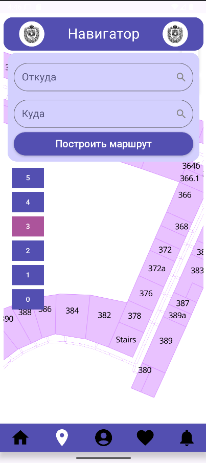
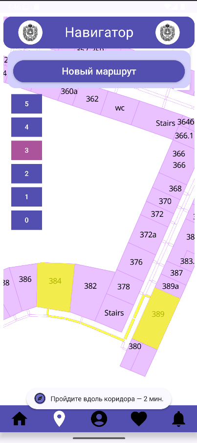

# BMSTU Spotlight
---
Приложение для навигации по кампусу МГТУ им. Н.Э. Баумана. 
Позволяет пользователю построить маршрут до точки назначения, получить краткую информацию о ключевых локациях университета, будь то коворкинг-зоны или кафетерии. 
# Команда авторов
---
- [Илья Нефёдов](https://github.com/ilyaniafiodau), менеджер-разработчик.
- [Анна Исаева](https://github.com/cr3at1v3annis), дизайнер-разработчик.
- [Александр Обехов](https://github.com/MrSashaNeo), разработчик.
- [Владислав Орешко](https://github.com/ByteTheKernel), разработчик.
# Функционал
---
## Вход в приложение
При запуске приложения будет высвечиваться окно логина в систему. Без данного входа приложением пользоваться будет на данный момент нельзя.
Для проверки логина используется рукописный сервер с использованием Ktor, ссылка с описанием [тут](https://github.com/thread-sleepers/Spotlight-Backend).

## Навигатор по ВУЗу
Навигатор по ВУЗу (оно же главное окно), построен на WebView. Карты показаны при помощи технологии MapTiler. Сами карты были сделаны вручную, при помощи приложения QGis. 

После выбора одной аудитории она подсвечивается другим цветом для удобства пользователям. 

После выбора маршрута простраивается маршрут. Сам маршрут и время отчитывается при помощи алгоритма Дейкстры.

## Экран "Меню" (с различными тематическими мастами и мероприятиями)
Экран, по которому можно посмотреть списки столовых и кафетериев, коворкинг-зон, проведение различных мероприятий на территории ВУЗа, аудиторий, магазинов.

## Экран профиля
На данном экране выведена информация о пользователе, реализована возможность выйти из профиля.

## Экран недавних и сохраненных локаций
На данном экране можно посмотреть списки сохраненных пользователем локаций. Данные локации уникальны для каждого пользователя, информация берется с локального сервера. При нажатии на локацию автоматически переводится на экран навигатора с подсвечиванием данной локации.

## Экран расписания
На данном экране можно посмотреть расписание для пользователя. Оно, как и ранее описанные локации, берутся с локального сервера.

# Краткие выводы
---
- Реализован основной функционал по построению маршрута из одной аудитории в другую. Для построения маршрута и отсчета необходимого времени используется алгоритм Дейкстры.
- Было множество исследований на тему отрисовки карт и отображении их в приложении. Как результат, выбор пал на рукописную отрисовку карт в приложении QGis и последующей их стилизацией на сервере MapTiler. Отображение в приложении происходит посредством работы с WebView.
- Для входа в приложении, получения списка сохраненных и недавних локаций, расписания используется рукописный сервер с применением технологии Ktor.
- UI приложения целиком построен на Composе, тип приложения MVVM.
# Планы на будущее
---
- Доотрисовка карт до "полных" этажей
- Интеграция с действующим сервисом расписания для студентов МГТУ им. Н. Э. Баумана
- Расширение функционала для всего кампуса, построение маршрутов между кампусами
- Расширение функционала для зданий других ВУЗов
- Настройка безопасности приложения
